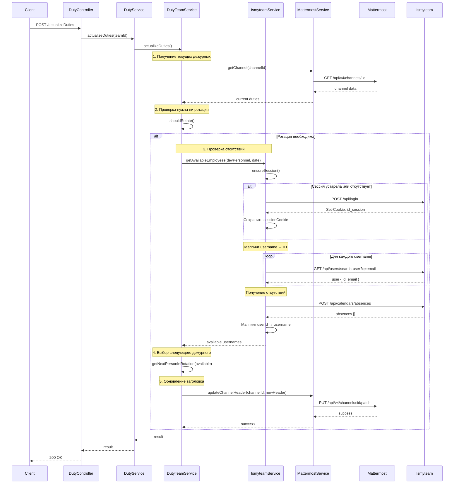
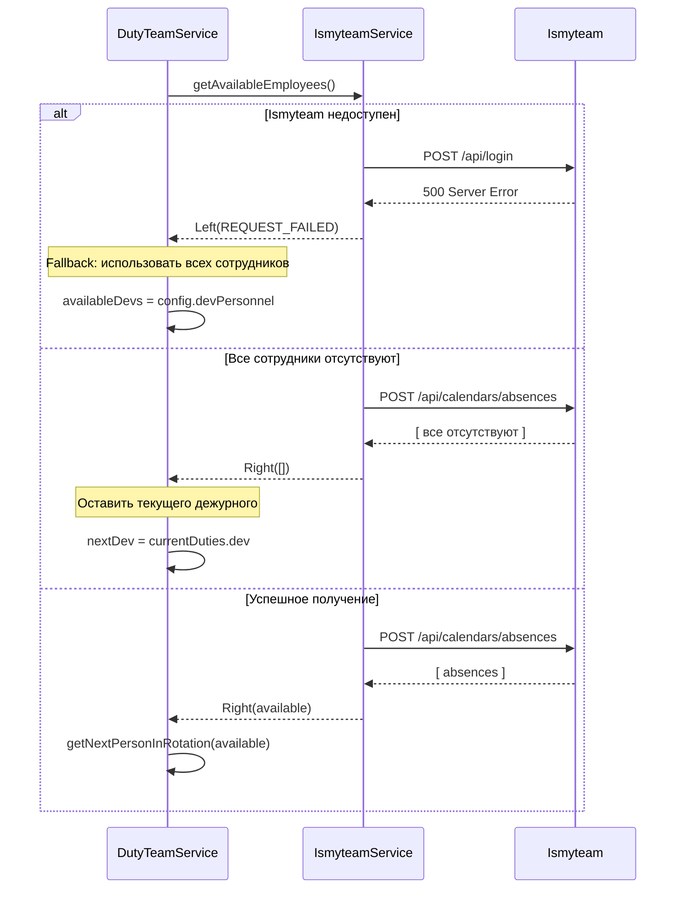

# Полный технический обзор интеграции ismyteam в систему дежурств

## Содержание
1. [C4 Model - Архитектура](#c4-model---архитектура)
2. [Sequence Diagram - Взаимодействие компонентов](#sequence-diagram---взаимодействие-компонентов)
3. [Публичные методы](#публичные-методы)
4. [Приватные методы](#приватные-методы)
5. [Псевдокод интеграции](#псевдокод-интеграции)
6. [Публичные типы](#публичные-типы)
7. [Конфигурация](#конфигурация)
8. [API тесты](#api-тесты)
9. [Юнит тесты](#юнит-тесты)

---

# C4 Model - Архитектура

## Level 1: System Context

Высокоуровневая диаграмма показывает взаимодействие системы ps_bot с внешними системами и пользователями.

```
┌─────────────────────────────────────────────────────────────┐
│                     System Context                          │
│                                                             │
│                                                             │
│  ┌──────────────┐                                          │
│  │   Dev Team   │                                          │
│  │   QA Team    │                                          │
│  └──────┬───────┘                                          │
│         │ Взаимодействие                                   │
│         │ через Mattermost                                 │
│         ▼                                                   │
│  ┌──────────────────────────────────────┐                 │
│  │                                      │                 │
│  │        ps_bot System                 │                 │
│  │                                      │                 │
│  │  Автоматизация ротации дежурных     │                 │
│  │  с учётом отсутствий сотрудников    │                 │
│  │                                      │                 │
│  └──┬────────────────────────┬─────────┘                 │
│     │                        │                            │
│     │ Обновление            │ Проверка                  │
│     │ заголовка             │ отсутствий                │
│     │                        │                            │
│     ▼                        ▼                            │
│  ┌──────────────┐      ┌──────────────┐                 │
│  │  Mattermost  │      │   ismyteam   │                 │
│  │              │      │              │                 │
│  │ Корпоративный│      │ Система учёта│                 │
│  │ мессенджер   │      │ отсутствий   │                 │
│  └──────────────┘      └──────────────┘                 │
│                                                             │
└─────────────────────────────────────────────────────────────┘
```

### Описание систем

**ps_bot System**
- Автоматическая ротация дежурных разработчиков и QA
- Учёт отсутствий сотрудников
- Управление через REST API

**Mattermost**
- Корпоративный мессенджер
- Отображение текущих дежурных в заголовке канала
- Используется для уведомлений

**ismyteam**
- Система учёта отпусков, больничных, командировок
- Источник данных об отсутствиях сотрудников
- Предоставляет REST API

**Пользователи**
- Dev Team: разработчики, участвующие в дежурствах
- QA Team: QA инженеры, участвующие в дежурствах

---

## Level 2: Container

Показывает внутреннюю структуру ps_bot на уровне контейнеров/приложений.

```
┌────────────────────────────────────────────────────────────────┐
│                        ps_bot System                           │
│                                                                │
│  ┌──────────────────────────────────────────────────────────┐ │
│  │          ps_bot Application (NestJS)                     │ │
│  │                                                          │ │
│  │  ┌────────────────┐      ┌────────────────┐            │ │
│  │  │  Duty Module   │      │  Other Modules │            │ │
│  │  │                │      │                │            │ │
│  │  │ REST API       │      │  ...           │            │ │
│  │  │ Бизнес-логика  │      │                │            │ │
│  │  │                │      │                │            │ │
│  │  └────────────────┘      └────────────────┘            │ │
│  │                                                          │ │
│  └───────────┬────────────────────┬─────────────────────────┘ │
│              │                    │                           │
│              │ HTTPS              │ HTTPS                     │
│              │                    │                           │
└──────────────┼────────────────────┼───────────────────────────┘
               │                    │
               │                    │
        ┌──────▼──────┐      ┌──────▼──────┐
        │ Mattermost  │      │  ismyteam   │
        │   API       │      │    API      │
        │             │      │             │
        │ Bearer auth │      │ Cookie auth │
        └─────────────┘      └─────────────┘
```

### Описание контейнеров

**ps_bot Application**
- Технология: NestJS (Node.js)
- Ответственность: Координация дежурств, REST API
- Протоколы: HTTPS для внешних вызовов

**Duty Module**
- Модуль NestJS для управления дежурствами
- Интегрируется с Mattermost и ismyteam
- Предоставляет REST endpoints

**Mattermost API**
- Внешний сервис
- Авторизация: Bearer token
- Используется для обновления заголовков каналов

**ismyteam API**
- Внешний сервис
- Авторизация: Cookie-based (id_session)
- Используется для получения данных об отсутствиях

---

## Level 3: Component

Детализация компонентов внутри Duty Module.

```
┌────────────────────────────────────────────────────────────────────┐
│                        Duty Module                                 │
│                                                                    │
│  ┌──────────────────┐                                             │
│  │ DutyController   │  REST API endpoints                         │
│  │                  │  - POST /actualizeDuties                    │
│  │                  │  - POST /setDuties                          │
│  │                  │  - GET  /getDuties                          │
│  └────────┬─────────┘                                             │
│           │                                                        │
│           │ вызывает                                               │
│           ▼                                                        │
│  ┌──────────────────┐                                             │
│  │  DutyService     │  Координатор команд                         │
│  │                  │  - Управляет DutyTeamService                │
│  │                  │  - Инициализирует сервисы                   │
│  └────┬────────┬────┘                                             │
│       │        │                                                   │
│       │        │ создаёт/использует                                │
│       ▼        ▼                                                   │
│  ┌────────────────┐       ┌──────────────────┐                   │
│  │ DutyTeamService│       │ IsmyteamService  │ ◄── НОВЫЙ         │
│  │                │       │                  │                    │
│  │ Бизнес-логика  │       │ Клиент ismyteam  │                    │
│  │ ротации        │◄──────┤ API              │                    │
│  │                │ исп-т │                  │                    │
│  └────────┬───────┘       └──────────────────┘                   │
│           │                                                        │
│           │ использует                                             │
│           ▼                                                        │
│  ┌──────────────────┐                                             │
│  │ MattermostService│  Клиент Mattermost API                      │
│  │                  │  - getChannel()                             │
│  │                  │  - updateChannelHeader()                    │
│  └──────────────────┘                                             │
│                                                                    │
│  ┌──────────────────┐                                             │
│  │ DutyConfigSvc    │  Провайдер конфигурации                     │
│  │                  │  - Чтение config/default.json               │
│  └──────────────────┘                                             │
│                                                                    │
└────────────────────────────────────────────────────────────────────┘
```

### Описание компонентов

**DutyController**
- Ответственность: REST API endpoints
- Зависимости: DutyService
- Технология: NestJS Controller

**DutyService**
- Ответственность: Координация команд, создание сервисов
- Зависимости: DutyTeamService, IsmyteamService, MattermostService
- Шаблон: Facade

**DutyTeamService**
- Ответственность: Бизнес-логика ротации для одной команды
- Зависимости: IsmyteamService (опционально), MattermostService
- Основной метод: `determineNextOnDutyPersonnel()`

**IsmyteamService** ⭐ Новый компонент
- Ответственность: HTTP клиент для ismyteam API
- Основные методы:
  - `getAbsentEmployees(usernames, date)`
  - `getAvailableEmployees(usernames, date)`
  - `isAbsent(username, date)`
- Управление сессией (cookie-based auth)

**MattermostService**
- Ответственность: HTTP клиент для Mattermost API
- Методы: `getChannel()`, `updateChannelHeader()`
- Авторизация: Bearer token

**DutyConfigService**
- Ответственность: Чтение и валидация конфигурации
- Источник: config/default.json

---

## Level 4: Code

Детализация на уровне классов и методов для IsmyteamService.

```
┌────────────────────────────────────────────────────────────────┐
│                      IsmyteamService                           │
├────────────────────────────────────────────────────────────────┤
│ Private Fields:                                                │
│  - sessionCookie: string | null                                │
│  - sessionExpiry: DateTime | null                              │
│  - config: IsmyteamConfig                                      │
│  - http: HttpRequestService                                    │
│  - logger: Logger                                              │
├────────────────────────────────────────────────────────────────┤
│ Public Methods:                                                │
│                                                                │
│  ┌──────────────────────────────────────────────────────┐     │
│  │ + getAbsentEmployees(usernames, date?)              │     │
│  │   : Promise<Either<Error, string[]>>                │     │
│  │                                                      │     │
│  │   Получить список отсутствующих сотрудников         │     │
│  │   ┌────────────────────────────────────────┐        │     │
│  │   │ 1. ensureSession()                     │        │     │
│  │   │ 2. getUserIds(usernames)               │        │     │
│  │   │ 3. getAbsences(userIds, date, date)    │        │     │
│  │   │ 4. Маппинг userId → username           │        │     │
│  │   └────────────────────────────────────────┘        │     │
│  └──────────────────────────────────────────────────────┘     │
│                                                                │
│  ┌──────────────────────────────────────────────────────┐     │
│  │ + getAvailableEmployees(usernames, date?)           │     │
│  │   : Promise<Either<Error, string[]>>                │     │
│  │                                                      │     │
│  │   Инверсия getAbsentEmployees()                     │     │
│  └──────────────────────────────────────────────────────┘     │
│                                                                │
│  ┌──────────────────────────────────────────────────────┐     │
│  │ + isAbsent(username, date?)                          │     │
│  │   : Promise<Either<Error, boolean>>                 │     │
│  │                                                      │     │
│  │   Проверка одного сотрудника                         │     │
│  └──────────────────────────────────────────────────────┘     │
├────────────────────────────────────────────────────────────────┤
│ Private Methods:                                               │
│                                                                │
│  ┌──────────────────────────────────────────────────────┐     │
│  │ - ensureSession()                                    │     │
│  │   : Promise<Either<Error, void>>                    │     │
│  │                                                      │     │
│  │   Проверить актуальность сессии,                     │     │
│  │   вызвать login() если нужно                         │     │
│  └──────────────────────────────────────────────────────┘     │
│                                                                │
│  ┌──────────────────────────────────────────────────────┐     │
│  │ - login()                                            │     │
│  │   : Promise<Either<Error, void>>                    │     │
│  │                                                      │     │
│  │   POST /api/login                                    │     │
│  │   Извлечь id_session из Set-Cookie                   │     │
│  │   Вычислить sessionExpiry                            │     │
│  └──────────────────────────────────────────────────────┘     │
│                                                                │
│  ┌──────────────────────────────────────────────────────┐     │
│  │ - getUserIds(usernames)                              │     │
│  │   : Promise<Either<Error, {username, id}[]>>        │     │
│  │                                                      │     │
│  │   Для каждого username:                              │     │
│  │     - Конвертация в email                            │     │
│  │     - searchUser(email)                              │     │
│  │     - Сбор результатов                               │     │
│  └──────────────────────────────────────────────────────┘     │
│                                                                │
│  ┌──────────────────────────────────────────────────────┐     │
│  │ - searchUser(email)                                  │     │
│  │   : Promise<Either<Error, IsmyteamUserDto>>         │     │
│  │                                                      │     │
│  │   GET /api/users/search-user?q=email                │     │
│  │   Возврат первого результата                         │     │
│  └──────────────────────────────────────────────────────┘     │
│                                                                │
│  ┌──────────────────────────────────────────────────────┐     │
│  │ - getAbsences(userIds, from, to)                     │     │
│  │   : Promise<Either<Error, IsmyteamAbsenceDto[]>>    │     │
│  │                                                      │     │
│  │   POST /api/calendars/absences                       │     │
│  │   Body: { id: [1001, 1002], from, to }              │     │
│  └──────────────────────────────────────────────────────┘     │
│                                                                │
│  ┌──────────────────────────────────────────────────────┐     │
│  │ - doRequest<T>(method, url, responseType, ...)       │     │
│  │   : Promise<Either<Error, T>>                       │     │
│  │                                                      │     │
│  │   Унифицированный метод для HTTP запросов            │     │
│  │   - Добавление Cookie header                         │     │
│  │   - Валидация ответа                                 │     │
│  │   - Обработка ошибок (401 → AUTH_FAILED)            │     │
│  └──────────────────────────────────────────────────────┘     │
│                                                                │
└────────────────────────────────────────────────────────────────┘
```

---

# Sequence Diagram - Взаимодействие компонентов

## Основной флоу: actualizeDuties с проверкой отсутствий



## Флоу обработки ошибок



---

# Публичные методы

## IsmyteamService

### getAbsentEmployees(usernames: string[], date?: DateTime)
- **Входные параметры:**
  - `usernames: string[]` - массив username'ов (например, `['andrey.plotnikov', 'pavel.sukhonosov']`)
  - `date?: DateTime` - дата для проверки (опционально, по умолчанию - сегодня)
- **Возвращает:** `Promise<Either<IsmyteamErrorCodes, string[]>>`
- **Описание:** Получает список отсутствующих сотрудников на указанную дату
- **Пример использования:**
  ```typescript
  const result = await ismyteamService.getAbsentEmployees(
    ['andrey.plotnikov', 'pavel.sukhonosov'],
    DateTime.fromISO('2025-05-23')
  );
  if (isRight(result)) {
    console.log('Absent:', result.right); // ['pavel.sukhonosov']
  }
  ```

### getAvailableEmployees(usernames: string[], date?: DateTime)
- **Входные параметры:**
  - `usernames: string[]` - массив username'ов
  - `date?: DateTime` - дата для проверки (опционально)
- **Возвращает:** `Promise<Either<IsmyteamErrorCodes, string[]>>`
- **Описание:** Получает список доступных (не отсутствующих) сотрудников. Является инверсией `getAbsentEmployees`
- **Пример использования:**
  ```typescript
  const result = await ismyteamService.getAvailableEmployees(
    ['andrey.plotnikov', 'pavel.sukhonosov', 'roman.romashko']
  );
  if (isRight(result)) {
    console.log('Available:', result.right); // ['andrey.plotnikov', 'roman.romashko']
  }
  ```

### isAbsent(username: string, date?: DateTime)
- **Входные параметры:**
  - `username: string` - username сотрудника
  - `date?: DateTime` - дата для проверки (опционально)
- **Возвращает:** `Promise<Either<IsmyteamErrorCodes, boolean>>`
- **Описание:** Проверяет, отсутствует ли конкретный сотрудник на указанную дату
- **Пример использования:**
  ```typescript
  const result = await ismyteamService.isAbsent('andrey.plotnikov');
  if (isRight(result)) {
    console.log('Is absent:', result.right); // false
  }
  ```

## DutyTeamService

### actualizeDuties()
- **Входные параметры:** нет
- **Возвращает:** `Promise<Either<ActualizeDutiesErrorCodes, ActualizeDutiesResult>>`
- **Описание:** Актуализирует дежурных с учетом отсутствий. Вызывает ismyteamService для проверки доступности сотрудников
- **Изменения:** Теперь использует `ismyteamService.getAvailableEmployees()` для фильтрации доступных сотрудников перед ротацией

---

# Приватные методы

## IsmyteamService

### ensureSession()
- **Возвращает:** `Promise<Either<IsmyteamErrorCodes, void>>`
- **Описание:** Проверяет актуальность текущей сессии. Если сессия отсутствует или истекла, вызывает `login()`
- **Логика:**
  ```typescript
  if (sessionCookie && sessionExpiry && now < sessionExpiry) {
    return success;
  }
  return login();
  ```

### login()
- **Возвращает:** `Promise<Either<IsmyteamErrorCodes, void>>`
- **Описание:** Выполняет авторизацию в ismyteam API
- **API:** `POST /api/login` с `{ email, password }`
- **Обработка:**
  - Извлекает `id_session` из заголовка `Set-Cookie`
  - Вычисляет `sessionExpiry` из `Max-Age` или `Expires`
  - Сохраняет в `this.sessionCookie` и `this.sessionExpiry`

### getUserIds(usernames: string[])
- **Возвращает:** `Promise<Either<IsmyteamErrorCodes, Array<{ username: string; id: number }>>>`
- **Описание:** Конвертирует массив username'ов в ismyteam ID
- **Логика:**
  - Для каждого username конвертирует в email: `${username}@onetwotrip.com`
  - Вызывает `searchUser(email)` для получения ID
  - Возвращает массив `{ username, id }`
  - Если не найден ни один пользователь, возвращает `USERS_NOT_FOUND`

### searchUser(email: string)
- **Возвращает:** `Promise<Either<IsmyteamErrorCodes, IsmyteamUserDto>>`
- **Описание:** Ищет пользователя по email в ismyteam
- **API:** `GET /api/users/search-user?q=email&page=1&perPage=10`
- **Обработка:** Возвращает первого пользователя из результатов

### getAbsences(userIds: Array<{username, id}>, from: string, to: string)
- **Возвращает:** `Promise<Either<IsmyteamErrorCodes, IsmyteamAbsenceDto[]>>`
- **Описание:** Получает список отсутствий для указанных пользователей в диапазоне дат
- **API:** `POST /api/calendars/absences` с body `{ id: [1001, 1002], from: 'DD.MM.YYYY', to: 'DD.MM.YYYY' }`

### doRequest<T>(method, url, responseType, data, config)
- **Возвращает:** `Promise<Either<IsmyteamErrorCodes, T>>`
- **Описание:** Унифицированный метод для выполнения HTTP запросов
- **Функции:**
  - Добавляет `Cookie: ${sessionCookie}` к заголовкам
  - Валидирует ответ через `transformAndValidate` (если указан `responseType`)
  - Обрабатывает ошибки:
    - 401/403 → `AUTH_FAILED`
    - Другие → `REQUEST_FAILED`

---

# Псевдокод интеграции

## Интеграция в DutyService (инициализация)

```typescript
// src/ps_bot/duty/duty.service.ts

@Injectable()
export class DutyService {
  private readonly ismyteamService: IsmyteamService | null = null;

  constructor(
    private readonly http: HttpRequestService,
    @Inject(CONFIG) private readonly configService: IConfig,
    private readonly configProvider: DutyConfigProvider,
    logger: Logger,
  ) {
    // Инициализация ismyteamService (опционально)
    const ismyteamConfig = this.getIsmyteamConfig();
    if (ismyteamConfig) {
      this.ismyteamService = new IsmyteamService(
        ismyteamConfig,
        this.http,
        this.logger
      );
    }
  }

  private getIsmyteamConfig(): IsmyteamConfig | null {
    const config = this.configService.get<IsmyteamConfig>('ps_bot.ismyteam', null);

    if (!config || !config.apiUrl || !config.email || !config.password) {
      this.logger.info('Ismyteam config not found, absence checking disabled');
      return null;
    }

    return config;
  }

  private getTeamService(teamId: string): Either<Error, DutyTeamService> {
    // Передача ismyteamService в DutyTeamService
    return new DutyTeamService(
      teamId,
      this.configProvider,
      this.mattermostService,
      this.ismyteamService, // ← Новый параметр
      this.logger,
    );
  }
}
```

## Интеграция в DutyTeamService (использование)

```typescript
// src/ps_bot/duty/duty_team.service.ts

export class DutyTeamService {
  constructor(
    private readonly teamId: string,
    private readonly configProvider: DutyConfigProvider,
    private readonly mattermostService: MattermostService,
    private readonly ismyteamService: IsmyteamService | null, // ← Добавить
    logger: Logger,
  ) {}

  private async determineNextOnDutyPersonnel(
    devTodayChanged: boolean,
    qaTodayChanged: boolean,
    currentDuties: GetDutiesDTO,
  ): Promise<{ nextDev?: string; nextQa?: string }> {
    const result: { nextDev?: string; nextQa?: string } = {};
    const now = DateTime.now();

    // === DEV ROTATION ===
    if (!devTodayChanged) {
      let availableDevs = this.config.devPersonnel;

      // Проверка отсутствий (если сервис доступен)
      if (this.ismyteamService) {
        const result = await this.ismyteamService.getAvailableEmployees(
          this.config.devPersonnel,
          now,
        );

        if (isRight(result)) {
          availableDevs = result.right;
          log.info(`Available devs: ${availableDevs.length}/${this.config.devPersonnel.length}`);
        } else {
          log.warn(`Ismyteam failed: ${result.left}, using all personnel`);
          // Fallback: используем всех
        }
      }

      // Обработка случая, когда все отсутствуют
      if (availableDevs.length === 0) {
        log.warn('All devs absent, keeping current');
        result.nextDev = currentDuties.dev;
      } else {
        // Стандартная ротация с учетом доступных
        result.nextDev = this.getNextPersonInRotation(
          availableDevs,
          history,
          currentDuties.dev,
        );
      }
    }

    // === QA ROTATION === (аналогично)
    if (!qaTodayChanged) {
      let availableQas = this.config.qaPersonnel;

      if (this.ismyteamService) {
        const result = await this.ismyteamService.getAvailableEmployees(
          this.config.qaPersonnel,
          now,
        );

        if (isRight(result)) {
          availableQas = result.right;
        } else {
          log.warn(`Ismyteam failed, using all QAs`);
        }
      }

      if (availableQas.length === 0) {
        result.nextQa = currentDuties.qa;
      } else {
        result.nextQa = this.getNextPersonInRotation(
          availableQas,
          history,
          currentDuties.qa,
        );
      }
    }

    return result;
  }
}
```

## Обработка edge cases

```typescript
// Edge case 1: Все сотрудники отсутствуют
if (availableDevs.length === 0) {
  log.warn('All devs are absent, keeping current dev on duty');
  result.nextDev = currentDuties.dev;
}

// Edge case 2: Сервис ismyteam недоступен
if (isLeft(availableDevsResult)) {
  log.warn(`Failed to fetch available devs: ${availableDevsResult.left}`);
  availableDevs = this.config.devPersonnel; // Fallback
}

// Edge case 3: Конфиг ismyteam отсутствует
if (!this.ismyteamService) {
  // Работаем в старом режиме без проверки отсутствий
  availableDevs = this.config.devPersonnel;
}
```

---

# Публичные типы

```typescript
// src/ps_bot/duty/ismyteam.service.ts

export type IsmyteamConfig = {
  apiUrl: string;
  email: string;
  password: string;
};

export enum IsmyteamErrorCodes {
  AUTH_FAILED = 'AUTH_FAILED',
  USER_NOT_FOUND = 'USER_NOT_FOUND',
  USERS_NOT_FOUND = 'USERS_NOT_FOUND',
  REQUEST_FAILED = 'REQUEST_FAILED',
}

export class IsmyteamUserDto {
  @IsNumber()
  id: number;

  @IsString()
  email: string;

  @IsString()
  @IsOptional()
  firstName?: string;

  @IsString()
  @IsOptional()
  lastName?: string;
}

export class IsmyteamAbsenceDto {
  @IsNumber()
  userId: number;

  @IsString()
  date: string; // DD.MM.YYYY

  @IsString()
  @IsOptional()
  reason?: string;
}

export class IsmyteamSearchUserResponseDto {
  @IsArray()
  @ValidateNested({ each: true })
  @Type(() => IsmyteamUserDto)
  users: IsmyteamUserDto[];

  @IsNumber()
  total: number;
}

export class IsmyteamAbsencesResponseDto {
  @IsArray()
  @ValidateNested({ each: true })
  @Type(() => IsmyteamAbsenceDto)
  absences: IsmyteamAbsenceDto[];
}
```

---

# Конфигурация

## config/default.json

```json
{
  "ps_bot": {
    "mattermostApiUrl": "https://onetwotrip.loop.ru",
    "mattermostToken": "xxx",
    "ismyteam": {
      "apiUrl": "https://onetwotrip.ismyteam.ru",
      "email": "anton.sozonov@onetwotrip.com",
      "password": "asqS2!M6AAf7!4e"
    },
    "dutyHeaderPattern": "Дежурный бэк ${dev} \nДежурный QA ${qa}",
    "dutyChangeTime": "07:59",
    "timeZone": "Europe/Moscow",
    "maxHistoryPeriodHours": 168,
    "teams": {
      "ps": {
        "dutyChannelId": "44ohs3rp4bympfgfj4h1qx9yyc",
        "devPersonnel": ["andrey.plotnikov", "pavel.sukhonosov", "roman.romashko"],
        "qaPersonnel": ["oksana.ivanova", "evgeniya.bobkova"]
      }
    }
  }
}
```

### Изменения в конфигурации

**Добавлено:**
- `ps_bot.ismyteam` - секция конфигурации для ismyteam API
  - `apiUrl` - базовый URL ismyteam API
  - `email` - email для авторизации
  - `password` - пароль для авторизации

**Важно:**
- Секция `ismyteam` опциональна. Если отсутствует, система работает без проверки отсутствий
- Все поля внутри `ismyteam` обязательны, если секция присутствует

---

# API тесты

## api_tests/common.ts - Расширение DutyTestSetup

```typescript
export class DutyTestSetup {
  public ismyteamMock: nock.Scope;

  async initialize() {
    this.ismyteamMock = nock('https://onetwotrip.ismyteam.ru').persist();
  }

  mockIsmyteamLogin(statusCode = 200, sessionCookie = 'id_session=test_session_123') {
    return this.ismyteamMock
      .post('/api/login')
      .reply(statusCode, {}, {
        'set-cookie': [sessionCookie],
      });
  }

  mockIsmyteamSearchUser(email: string, userId: number, statusCode = 200) {
    return this.ismyteamMock
      .get('/api/users/search-user')
      .query({ page: 1, perPage: 10, q: email })
      .reply(statusCode, {
        users: [{ id: userId, email }],
        total: 1,
      });
  }

  mockIsmyteamAbsences(
    userIds: number[],
    from: string,
    to: string,
    absences: Array<{ userId: number; date: string }>,
    statusCode = 200,
  ) {
    return this.ismyteamMock
      .post('/api/calendars/absences', {
        id: userIds,
        from,
        to,
      })
      .reply(statusCode, absences);
  }
}
```

## api_tests/actualize_duties_with_absences.api_test.ts

### Тест 1: Пропуск отсутствующего dev и выбор следующего

**Флоу:**
1. Текущий дежурный dev: `andrey.plotnikov`
2. `pavel.sukhonosov` отсутствует (в отпуске)
3. Ротация должна выбрать доступного dev'а (не `pavel.sukhonosov`)

**Сценарии:**
- ✅ `pavel.sukhonosov` не выбран, хотя по ротации его очередь
- ✅ Выбран один из доступных: `andrey.plotnikov` или `roman.romashko`
- ✅ Заголовок канала обновлён

```typescript
it('should skip absent dev and select next available', async () => {
  MockDate.set(createMoscowDateTime('2025-05-23T10:00:00').toJSDate());

  const channelId = '44ohs3rp4bympfgfj4h1qx9yyc';
  const currentHeader = 'Дежурный бэк @andrey.plotnikov \nДежурный QA @oksana.ivanova';

  testSetup.mockMattermostChannelResponse(channelId, { header: currentHeader });
  testSetup.mockMattermostChannelPosts(channelId, { order: [], posts: {} });
  testSetup.mockMattermostChannelUpdate(channelId);

  testSetup.mockIsmyteamLogin();
  testSetup.mockIsmyteamSearchUser('andrey.plotnikov@onetwotrip.com', 1001);
  testSetup.mockIsmyteamSearchUser('pavel.sukhonosov@onetwotrip.com', 1002);
  testSetup.mockIsmyteamSearchUser('roman.romashko@onetwotrip.com', 1003);

  testSetup.mockIsmyteamAbsences(
    [1001, 1002, 1003],
    '23.05.2025',
    '23.05.2025',
    [{ userId: 1002, date: '23.05.2025' }], // pavel отсутствует
  );

  testSetup.mockIsmyteamAbsences([2001, 2002], '23.05.2025', '23.05.2025', []);

  const response = await testSetup.request
    .post('/ps-bot/duty/ps/actualizeDuties')
    .set(...testSetup.getAuthHeader())
    .expect(200);

  expect(response.body.result.nextDev).not.toBe('pavel.sukhonosov');
  expect(['andrey.plotnikov', 'roman.romashko']).toContain(response.body.result.nextDev);
});
```

### Тест 2: Все dev отсутствуют - оставить текущего

**Флоу:**
1. Все dev в списке отсутствуют
2. Система должна оставить текущего дежурного

**Сценарии:**
- ✅ `nextDev` = `undefined` (не меняем дежурного)
- ✅ Заголовок канала не обновляется

```typescript
it('should keep current dev if all are absent', async () => {
  MockDate.set(createMoscowDateTime('2025-05-23T10:00:00').toJSDate());

  const channelId = '44ohs3rp4bympfgfj4h1qx9yyc';
  const currentHeader = 'Дежурный бэк @andrey.plotnikov \nДежурный QA @oksana.ivanova';

  testSetup.mockMattermostChannelResponse(channelId, { header: currentHeader });
  testSetup.mockMattermostChannelPosts(channelId, { order: [], posts: {} });

  testSetup.mockIsmyteamLogin();
  testSetup.mockIsmyteamSearchUser('andrey.plotnikov@onetwotrip.com', 1001);
  testSetup.mockIsmyteamSearchUser('pavel.sukhonosov@onetwotrip.com', 1002);
  testSetup.mockIsmyteamSearchUser('roman.romashko@onetwotrip.com', 1003);

  testSetup.mockIsmyteamAbsences(
    [1001, 1002, 1003],
    '23.05.2025',
    '23.05.2025',
    [
      { userId: 1001, date: '23.05.2025' },
      { userId: 1002, date: '23.05.2025' },
      { userId: 1003, date: '23.05.2025' },
    ],
  );

  testSetup.mockIsmyteamAbsences([2001, 2002], '23.05.2025', '23.05.2025', []);

  const response = await testSetup.request
    .post('/ps-bot/duty/ps/actualizeDuties')
    .set(...testSetup.getAuthHeader())
    .expect(200);

  expect(response.body.result.nextDev).toBeUndefined();
});
```

### Тест 3: Fallback при недоступности ismyteam

**Флоу:**
1. Сервис ismyteam недоступен (500 ошибка)
2. Система должна работать в fallback режиме (без проверки отсутствий)

**Сценарии:**
- ✅ Запрос завершается успешно (200)
- ✅ Выбран следующий дежурный из всего списка
- ✅ Логируется предупреждение о недоступности ismyteam

```typescript
it('should fallback to all personnel if ismyteam service fails', async () => {
  MockDate.set(createMoscowDateTime('2025-05-23T10:00:00').toJSDate());

  const channelId = '44ohs3rp4bympfgfj4h1qx9yyc';
  const currentHeader = 'Дежурный бэк @andrey.plotnikov \nДежурный QA @oksana.ivanova';

  testSetup.mockMattermostChannelResponse(channelId, { header: currentHeader });
  testSetup.mockMattermostChannelPosts(channelId, { order: [], posts: {} });
  testSetup.mockMattermostChannelUpdate(channelId);

  testSetup.mockIsmyteamLogin(500); // ошибка авторизации

  const response = await testSetup.request
    .post('/ps-bot/duty/ps/actualizeDuties')
    .set(...testSetup.getAuthHeader())
    .expect(200);

  expect(response.body.result.nextDev).toBeDefined();
  expect(response.body.result.nextQa).toBeDefined();
});
```

### Тест 4: QA отсутствует - выбрать доступного

**Флоу:**
1. Текущий QA: `oksana.ivanova`
2. `evgeniya.bobkova` отсутствует
3. Ротация должна оставить `oksana.ivanova` (единственная доступная)

**Сценарии:**
- ✅ QA не меняется, так как все остальные отсутствуют
- ✅ Dev ротация работает нормально

```typescript
it('should handle QA absence correctly', async () => {
  MockDate.set(createMoscowDateTime('2025-05-23T10:00:00').toJSDate());

  const channelId = '44ohs3rp4bympfgfj4h1qx9yyc';
  const currentHeader = 'Дежурный бэк @andrey.plotnikov \nДежурный QA @oksana.ivanova';

  testSetup.mockMattermostChannelResponse(channelId, { header: currentHeader });
  testSetup.mockMattermostChannelPosts(channelId, { order: [], posts: {} });
  testSetup.mockMattermostChannelUpdate(channelId);

  testSetup.mockIsmyteamLogin();
  testSetup.mockIsmyteamSearchUser('andrey.plotnikov@onetwotrip.com', 1001);
  testSetup.mockIsmyteamSearchUser('pavel.sukhonosov@onetwotrip.com', 1002);
  testSetup.mockIsmyteamSearchUser('roman.romashko@onetwotrip.com', 1003);
  testSetup.mockIsmyteamSearchUser('oksana.ivanova@onetwotrip.com', 2001);
  testSetup.mockIsmyteamSearchUser('evgeniya.bobkova@onetwotrip.com', 2002);

  testSetup.mockIsmyteamAbsences([1001, 1002, 1003], '23.05.2025', '23.05.2025', []);

  testSetup.mockIsmyteamAbsences(
    [2001, 2002],
    '23.05.2025',
    '23.05.2025',
    [{ userId: 2002, date: '23.05.2025' }], // evgeniya отсутствует
  );

  const response = await testSetup.request
    .post('/ps-bot/duty/ps/actualizeDuties')
    .set(...testSetup.getAuthHeader())
    .expect(200);

  expect(response.body.result.nextQa).toBe('oksana.ivanova');
});
```

---

# Юнит тесты

## ismyteam.service.spec.ts

### Тест 1: getAbsentEmployees - успешное получение

**Флоу:**
1. Авторизация → получение сессии
2. Маппинг usernames → IDs
3. Получение отсутствий
4. Маппинг IDs → usernames

**Сценарии:**
- ✅ Возвращает корректный список отсутствующих
- ✅ Сессия создается и переиспользуется
- ✅ API вызовы выполняются в правильном порядке

```typescript
describe('IsmyteamService', () => {
  let service: IsmyteamService;
  let httpMock: nock.Scope;

  beforeEach(() => {
    httpMock = nock('https://onetwotrip.ismyteam.ru');
    service = new IsmyteamService(
      {
        apiUrl: 'https://onetwotrip.ismyteam.ru',
        email: 'test@onetwotrip.com',
        password: 'password',
      },
      httpService,
      logger,
    );
  });

  it('should return absent employees', async () => {
    httpMock.post('/api/login').reply(200, {}, {
      'set-cookie': ['id_session=test123'],
    });

    httpMock.get('/api/users/search-user')
      .query({ q: 'user1@onetwotrip.com', page: 1, perPage: 10 })
      .reply(200, { users: [{ id: 1, email: 'user1@onetwotrip.com' }], total: 1 });

    httpMock.get('/api/users/search-user')
      .query({ q: 'user2@onetwotrip.com', page: 1, perPage: 10 })
      .reply(200, { users: [{ id: 2, email: 'user2@onetwotrip.com' }], total: 1 });

    httpMock.post('/api/calendars/absences', {
      id: [1, 2],
      from: '23.05.2025',
      to: '23.05.2025',
    }).reply(200, [
      { userId: 2, date: '23.05.2025' },
    ]);

    const result = await service.getAbsentEmployees(
      ['user1', 'user2'],
      DateTime.fromISO('2025-05-23'),
    );

    expect(isRight(result)).toBe(true);
    expect(result.right).toEqual(['user2']);
  });
});
```

### Тест 2: Повторное использование сессии

**Флоу:**
1. Первый вызов → авторизация
2. Второй вызов → использование существующей сессии (без повторной авторизации)

**Сценарии:**
- ✅ Login вызывается только один раз
- ✅ Сессия переиспользуется

```typescript
it('should reuse existing session', async () => {
  let loginCallCount = 0;

  httpMock.post('/api/login').reply(() => {
    loginCallCount++;
    return [200, {}, { 'set-cookie': ['id_session=test123; Max-Age=3600'] }];
  });

  httpMock.get('/api/users/search-user').times(4).reply(200, {
    users: [{ id: 1, email: 'user1@onetwotrip.com' }],
    total: 1,
  });

  httpMock.post('/api/calendars/absences').times(2).reply(200, []);

  await service.getAbsentEmployees(['user1'], DateTime.now());
  await service.getAbsentEmployees(['user1'], DateTime.now());

  expect(loginCallCount).toBe(1);
});
```

### Тест 3: Повторная авторизация при истечении сессии

**Флоу:**
1. Первый вызов → авторизация с коротким Max-Age
2. Ожидание истечения сессии
3. Второй вызов → повторная авторизация

**Сценарии:**
- ✅ Login вызывается дважды
- ✅ Сессия обновляется

```typescript
it('should re-authenticate when session expires', async () => {
  let loginCallCount = 0;

  httpMock.post('/api/login').reply(() => {
    loginCallCount++;
    return [200, {}, { 'set-cookie': ['id_session=test123; Max-Age=1'] }];
  }).persist();

  httpMock.get('/api/users/search-user').reply(200, {
    users: [{ id: 1, email: 'user1@onetwotrip.com' }],
    total: 1,
  }).persist();

  httpMock.post('/api/calendars/absences').reply(200, []).persist();

  await service.getAbsentEmployees(['user1'], DateTime.now());

  await new Promise(resolve => setTimeout(resolve, 1100));

  await service.getAbsentEmployees(['user1'], DateTime.now());

  expect(loginCallCount).toBe(2);
});
```

### Тест 4: Обработка ошибки USER_NOT_FOUND

**Флоу:**
1. Поиск пользователя возвращает пустой массив
2. Должна вернуться ошибка `USER_NOT_FOUND`

**Сценарии:**
- ✅ Возвращается Left с кодом `USER_NOT_FOUND`

```typescript
it('should return USER_NOT_FOUND when user not found', async () => {
  httpMock.post('/api/login').reply(200, {}, {
    'set-cookie': ['id_session=test123'],
  });

  httpMock.get('/api/users/search-user').reply(200, {
    users: [],
    total: 0,
  });

  const result = await service.getAbsentEmployees(['nonexistent'], DateTime.now());

  expect(isLeft(result)).toBe(true);
  expect(result.left).toBe(IsmyteamErrorCodes.USERS_NOT_FOUND);
});
```

### Тест 5: getAvailableEmployees - инверсия

**Флоу:**
1. Получение отсутствующих
2. Инверсия результата

**Сценарии:**
- ✅ Возвращает всех, кроме отсутствующих
- ✅ Порядок не важен

```typescript
it('should return available employees', async () => {
  httpMock.post('/api/login').reply(200, {}, {
    'set-cookie': ['id_session=test123'],
  });

  httpMock.get('/api/users/search-user')
    .query(true)
    .reply(200, { users: [{ id: 1, email: 'user1@onetwotrip.com' }], total: 1 })
    .persist();

  httpMock.post('/api/calendars/absences').reply(200, [
    { userId: 2, date: '23.05.2025' },
  ]);

  const result = await service.getAvailableEmployees(
    ['user1', 'user2', 'user3'],
    DateTime.fromISO('2025-05-23'),
  );

  expect(isRight(result)).toBe(true);
  expect(result.right).toEqual(['user1', 'user3']);
});
```

---

## Статистика тестового покрытия

### API тесты
- **Всего:** 4 теста
- **Сценарии:**
  - Пропуск отсутствующего dev
  - Все dev отсутствуют
  - Fallback при недоступности ismyteam
  - Обработка отсутствий QA

### Юнит тесты
- **Всего:** 5 тестов
- **Сценарии:**
  - Успешное получение отсутствующих
  - Повторное использование сессии
  - Повторная авторизация при истечении
  - Обработка ошибок (USER_NOT_FOUND)
  - getAvailableEmployees (инверсия)
